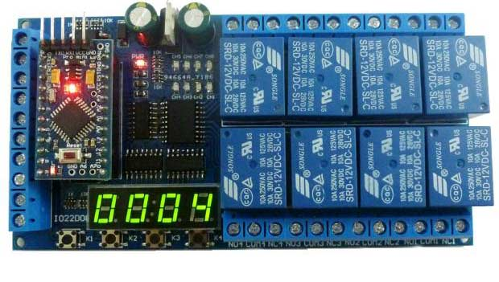

Podczas przeszukiwania internetu znalazłem całkiem ciekawą płytkę rozwojową która może posłużyć za dobrą bazę do sterownika automatyki. Jest to płytka o nazwie IO22D08 wiadomej chińskiej produkcji.

&nbsp;Niestety jedyne znalezione oprogramowanie tej płytki po długich poszukiwaniach było dalekie od zadowalającego. dlatego na jego bazie postanowiłem napisać swoją "bibliotekę"&nbsp; do obsługi płytki.

Płytka przystosowana jest do montażu z płytką Adruino Pro Mini lecz nic nie szkodzi aby np testowo podłączyć też zamiast niej bardziej popularne Arduino Nano.&nbsp; W tym celu zwieramy kawałkami przewodów wyjście D10 do A7 i D11do A6 i wkładamy jak na rysunku:

&nbsp;

Oprogramowanie.

W kodzie źródłowym zawarte są wszystkie definicje i procedury niezbędne do obsługi pytki.&nbsp;

Na samym początku musimy zdefiniować jakie Arduino wkładamy. Jeżeli jest to Nano pozostawiamy linię <code>#define NANO_AS_MINI </code>a jeżeli jest to oryginalne MINI - usuwamy ją.

obsługa funkcji jest bardzo prosta.

<strong>1. Obsługa przycisków K1..K4 i wejść IN1..IN8</strong>

W pętli <code>loop()</code> zamieszczamy funkcje:

<pre style="text-align: justify;">&nbsp; readINPUTS(); &nbsp; readKEYS();</pre>

Pierwsza odczytuje stan wejść druga stan przycisków. Program filtruje odczytane dane eliminując drgania zestyków wprowadzając 50ms pętlę na eliminację drgań dlatego te funkcje powinny wykonywać się dość często. Gdybyśmy dodali je do timera np używając flexiTimer2 jak w LCD mógłby powstać problem z wykrywaniem i detekcją zbocza (Naciśniecie, Puszczenie) - jeżeli nie jest nam to potrzebne wykorzystujemy tylko stan 1/0 oczywiście można to umieścić w procedurze flexiTimera.

odczytane dane mogą mieć wartości

<ul>
<li style="text-align: justify;">0 - wejście niepodłączone lub przycisk nie naciśnięty . Wartość IO_LOW</li>
<li style="text-align: justify;">1 - wejście zawarte do masy lub naciśnięty przycisk. Wartość IO_HIGH</li>
<li style="text-align: justify;">2 - moment zwierania wejścia / naciskania przycisku&nbsp; - zbocze narastające. Wartość IO_RISING</li>
<li style="text-align: justify;">3 - moment rozwierania wejścia / puszczenia przycisku&nbsp; - zbocze opadające. Wartość IO_FALLING</li>
</ul>

&nbsp;

wartości odczytujemy z tablic inValues i keysValues np:

<pre style="text-align: justify;">&nbsp;byte in1=inValues[0];  &nbsp;byte key1=keysValues[0]; </pre>

gdzie wartość 0 oznacza pierwsze wejście(IN1) lub przycisk(K1)&nbsp; itd kolejne aż do 7 dla wejść i do 3 dla przycisków 7 - wejście IN8. 3- przycisk K4.

&nbsp;

<strong>2. Obsługa LCD</strong>

&nbsp;LCD włączamy lub wyłączamy&nbsp; definiując 1 lub 0 w tej stałej:

<pre>#define USE_LCD 1

</pre>

Jeżeli płytka ma obsługiwać wyświetlacz LCD musimy go często odświeżać gdyż segmenty cyfr nie wyświetlają się na stałe - wymagałoby to odrobinę więcej elektroniki co wiadomo nie jest na rękę w masowej produkcji "po taniości".

Wyświetlacz można obsługiwać w pętli loop lub używając timera np FlexiTimer2.h, którego użyłem w przykładzie.

Wyświetlacz może wyświetlać cyfry oraz symulować w przybliżeniu alfabet i niektóre znaki.

Niestety kropka nie jest w pełni obsługiwana. Jedynie dostępny jest dwukropek dla drugiego segmentu.

Segmenty numerowane są od 0. 0 to pierwszy segment 1 drugi itd..

&nbsp;

Dostępne funkcje:

<code>clearLCD();</code> - czyści ekran .

 <code>setLCDdigit(segment, value, dots);</code> - ustawia w wybranym segmencie wartość liczbową.

segment - numer segmentu zaczynając od 0

value - może mieć wartość od 0 do 45 gdzie początkowe wartości to cyfry a kolejne litery. Na końcu są niektóre pozostałe znaki.

dots - parametr opcjonalny - wyświetla dwukropek na środku.

&nbsp;

<code>setLCDtext(char[]);</code> - wypisuje tekst

parametrem jest tekst do wpisania np <code>setLCDtext("TEST");</code>

&nbsp;

<code>setLCDTime(hour, minute,dots );</code> - wyświetla godzinę i minutę lub minutę i sekunde wg uznania oraz opcjonalnie dwukropek

 <code>setLCDbyInt(intValue);</code> - wyświetla liczbę całkowitą od -999 do 9999  Można także zdefiniować własne znaki. Aby to zrobić najpierw zobaczmy który segment za co odpowiada:

<code>&nbsp;&nbsp;&nbsp; --A--</code> <code>&nbsp;&nbsp;&nbsp; F---B</code> <code>&nbsp;&nbsp;&nbsp; --G--</code> <code>&nbsp;&nbsp;&nbsp; E---C</code> <code>&nbsp;&nbsp;&nbsp; --D--</code>

<code style="line-height: 0;">&nbsp; &nbsp; __&nbsp; __&nbsp;&nbsp; __&nbsp; __ &nbsp;&nbsp; |__||__|.|__||__| &nbsp;&nbsp; |__||__|'|__||__|</code>

Każdy z 4 elementów wyświetlacza&nbsp; składa się z 7 segmentów kolejno A,B,C,D,E,F,G

gdzie A,B,C to kolejne bity maski dla kodowanego znaku. A to najmniej ważny bit- nr.0&nbsp; G - najbardziej nr.6 przykładowo w zapisie binarnym będzie to wyglądać tak 0bGFEDCBA

np aby ustawić na wyświetlaczu cyfrę 1 musimy zapalić segmenty B i C da to cyfrę 0b00000110

maska jest negacją tej cyfry gdyż aktywny segment wyświetlacza wysterowywany jest w negacji - świeci gdy jest ustawiony bit na 0

np:&nbsp;&nbsp; mask= ~( 0b GFEDCBA);

Ósmy bit jest odpowiedzialny za kropkę, a w zasadzie za dwukropek i jest aktywny tylko dla drugiego segmentu. Stąd kropka nie jest obsługiwana.  <code>setCustomChar(segment, mask, dots);</code> - definiuje własny znak według maski w wybranym segmencie z opcjonalnym dwukropkiem.  <code>byte setCustomChar(segment,&nbsp; a,&nbsp; b,&nbsp; c, d,&nbsp; e,&nbsp; f,&nbsp; g ,&nbsp; dots );</code> - definiuje własny znak gdzie możemy wybrać które segmenty abcdefg&nbsp; mają być włączone 0- wyłączony 1- włączony. Dodatkowo funkcja zwraca obliczoną maskę np do późniejszego użytku.

&nbsp;

<strong>3. Obsługa przekaźników</strong>

Do obsługi przekaźników zdefiniowałem kilka funkcj:

<code>setRelay(relayNo);</code> - włącza wybrany przekaźnik. Numeracja zaczyna się od 1. Przekaźnik pierwszy&nbsp; wybieramy 1 drugi wybieramy 2

<code>resetRelay(relayNo);</code> - wyłącza wybrany przekaźnik.  <code>setRelayAndOffRest(relayNo);</code>&nbsp; - włącza wybrany przekaźnik i wyłącza pozostałe  <code>byte getRelay(relayNo);</code> - zwraca stan wybranego przekaźnika 0 lub 1  <code>clearRelays();</code>&nbsp; - wyłącza wszystkie przekaźniki

&nbsp;Jeżeli numeracja od 1 nam nie odpowiada i chcemy numerować od 0 nie ma problemu. Należy w pliku <code>lcdAndRelays.h</code> znaleźć i usunąć wszystkie linie z kodem <code>relayNo--;</code>

&nbsp;

&nbsp;

&nbsp;

Kod źródłowy można pobrać stąd: <a href="download/IO22D08.zip">IO22D08.zip</a> rozmiar ok. 7kB

